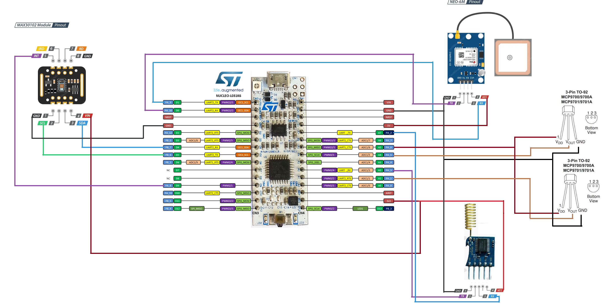

# Livestock Theft Prevention with IoT: Monitoring and Vital Signs Sensing System in Open Fields
This project designs a system of portable devices that integrates temperature sensors, heart rate monitors, and a GPS module to monitor the well-being and location of livestock in real-time. The collected data is transmitted via LoRa communication to a central node, where it is processed and sent to the cloud for analysis and management.

The proposed solution is cost-effective and aims to enhance livestock security while complying with animal welfare regulations. The objective is to reduce the impact of criminal activity in the sector by providing farmers with an advanced technological tool to protect and manage their assets.

## Quick start
### Minimal setup

### Connections:
* MAX30102 module: **SDA** to **PB_7**, **SCL** to **PB_6**, **INT** to **PA_8**, **V_IN** to **3.3V**, and **GND** to **GND**.
* NEO6M module: **RX** to **PA_9**, **TX** to **PA_10**, **V_IN** to **5V** (it operates with >3V, but the board's 3.3V output may sometimes drop below this value), and **GND** to **GND**.
* RYLR998 module: **RX** to **PA_2**, **TX** to **PA_3**, **VDD** to **3.3V**, and **GND** to **GND**.
* MCP9700 sensor: one **Vout** to **PA_4**, the other to **PA_5**, **VDD** to **PA_4**, and **GND** to **GND**.
